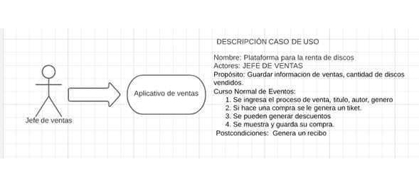

## Aplicación de venta y promociones de discos en una tienda
## Descripción del Problema
En su labor como programador de software, ha sido elegido para el desarrollo de una aplicación que necesita un propietario de una tienda de discos. El propietario desea expandir su alcance mediante una aplicación que permita mantener registros de usuarios, contraseñas, cuentas y compras de discos para mantener a los clientes recurrentes.

## Aclaraciones:

Se supondrá que la aplicación se requiere exclusivamente para la venta y promociones de la tienda de discos al comprar cierta cantidad de discos.
Con fines de simplicidad del ejemplo, no se contempla el almacenamiento persistente de los datos.
No se realizará validación ni se verificará la calidad de los datos ingresados.

## Aclaraciones adicionales
La aplicación se centrará únicamente en la venta y promoción de discos en la tienda, no contemplando otras funcionalidades relacionadas con la gestión de inventario, proveedores, etc.
No se implementará un sistema de almacenamiento persistente de los datos, por lo que la información se perderá al finalizar la ejecución de la aplicación.
La aplicación no realizará validación de los datos ingresados por el usuario, por lo que se asume que los datos ingresados serán correctos y coherentes.
La interfaz de usuario y la interacción con la aplicación se realizarán de forma simplificada, enfocándose en la lógica de negocio principal.

## JIRA

## Caso

## Pseudocodigo 
Algoritmo TiendaDiscos

    Función imprimir(mensaje)
        Escribir mensaje en la consola
    Fin Función

    Función principal
        Definir sc como un nuevo objeto Scanner
        Definir numeroDiscos como entero
        Definir total como decimal

        imprimir("Bienvenido a la Tienda de Discos")

        imprimir("Digite el número de discos: ")
        Leer numeroDiscos desde la entrada estándar

        Definir discos como un arreglo de Discos de tamaño numeroDiscos

        Para i desde 0 hasta numeroDiscos - 1 hacer
            imprimir("Digite el título del disco " + (i + 1) + ": ")
            Definir titulo como una cadena
            Leer titulo desde la entrada estándar

            imprimir("Digite el nombre del artista o banda: ")
            Definir artista como una cadena
            Leer artista desde la entrada estándar

            imprimir("Digite el precio del disco: ")
            Definir precio como decimal
            Leer precio desde la entrada estándar

            discos[i] <- nuevo Disco(titulo, artista, precio)
        Fin Para

        imprimir("----- Factura -----")

        Para i desde 0 hasta numeroDiscos - 1 hacer
            Definir disco como Disco
            disco <- discos[i]
            imprimir("Disco " + (i + 1) + ":")
            imprimir("Título: " + disco.getTitulo())
            imprimir("Artista: " + disco.getArtista())
            imprimir("Precio: $" + disco.getPrecio())
            imprimir("-------------------")

            total <- total + disco.getPrecio()
        Fin Para

        imprimir("Total a pagar: $" + total)
    Fin Función principal
